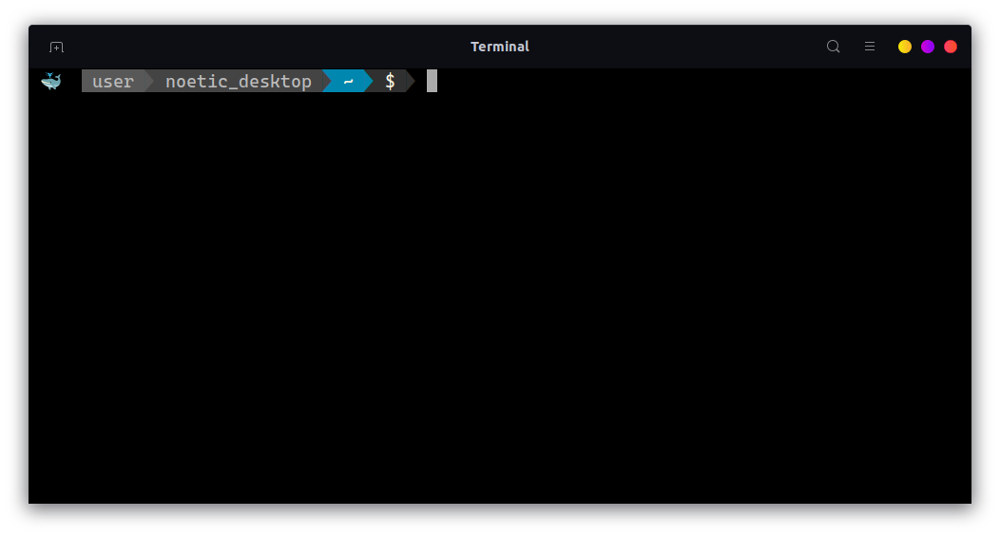
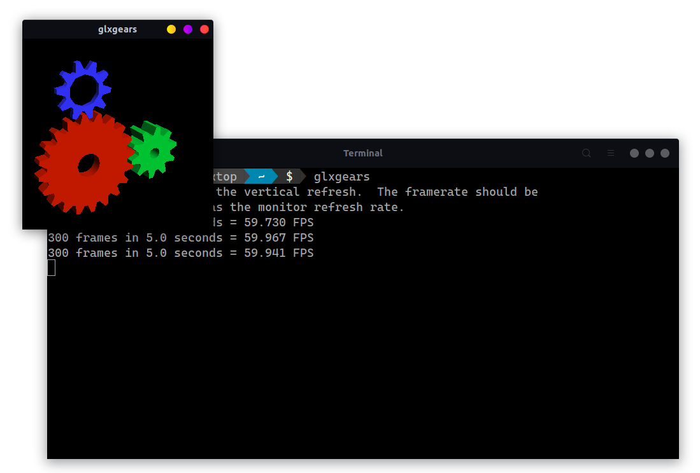
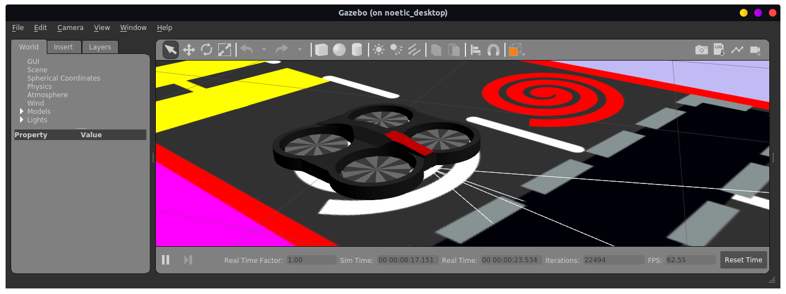
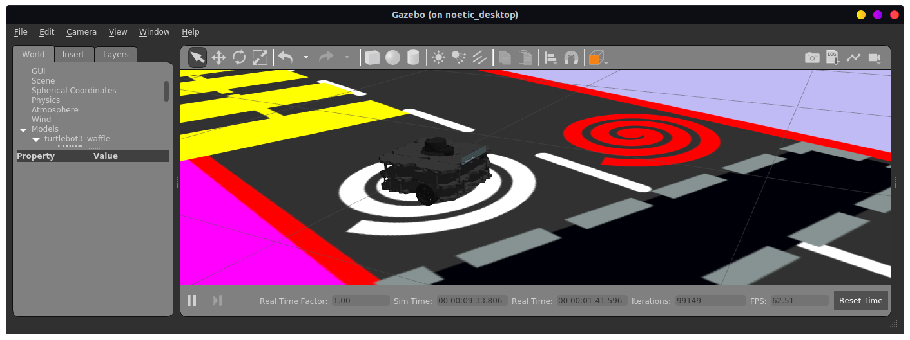

# ROSNoeticDocker
This repository contains the necessary elements (code and artifacts) to build a
ROS Noetic container suitable to execute GUI applications in Nvidia and
non-Nvidia docker environments. It includes the possibility to run simulations
for the TurtleBot 3 robot and the ARDrone.

The container is equipped with a few development and network-debug tools such as
vim, tmux, git, ping-utils, ... in order to program the robot and to diagnose
any issue.

*!!! Note: Do not clone this repository into a path containing a space !!!*

## Prerequisites
* A UNIX-like operating system, preferably Linux. (Ubuntu 20.04 is recommended.)
* The `glxinfo` command. (It's included with the `mesa-utils` package on Ubuntu. Execute `sudo apt install mesa-utils` before building the image.)
* An operational docker daemon.
* A terminal with a Nerd Font is highly recommended. ([Nerd Font Download page](https://www.nerdfonts.com/font-downloads))
* Standard Bash and basic ROS knowledge.
* A Nvidia graphics card capable of running hardware accelerated
  graphics. Although, any recent AMD or Intel GPU will also work flawlessly.

## Screenshots
The end result will be a Docker container capable of running ROS (GUI) systems.
A few virtual worlds are included. The following screenshots depict this perfectly.

The terminal after starting the container.
<p align="center">
  
</p>

Running GUI applications, including OpenGL should be possible.
<p align="center">
  
</p>

One of the included virtual worlds, summerforall, equipped with an AR.Drone or a Turtlebot3.
<p align="center">
  
</p>

<p align="center">
  
</p>


### Known issues
If Nvidia docker returns the following error:

```bash
   Docker: Error response from daemon: could not select device driver "" with capabilities: [[gpu]].
```

Look at the following site to solve it:

[https://docs.nvidia.com/datacenter/cloud-native/container-toolkit/install-guide.html#install-guide](https://docs.nvidia.com/datacenter/cloud-native/container-toolkit/install-guide.html#install-guide)

## How to build the container
A bash script is provided to build the container, it can be executed by entering the
following command:

```bash
   $ ./001_build_images.sh
```

## How to start the container
To start the container execute the script below:

```bash
   $ ./003_start_pxl_noetic_full_desktop.sh
```
This script will check the available GPU and start the container accordingly.

There's also an `004` script which adds webcam support to the container.
```bash
   $ ./004_start_pxl_noetic_full_desktop_with_webcam.sh
```

To use multiple bash shells in the container, It's advised to either work with
`tmux` or execute the script with prefix `005` from the host:

```bash
   $ ./005_attach_bash_to_noetic_full_desktop.sh
```

**Pro-tip: Learn to use `tmux`. It's awesome!**

## How to run the TurtleBot 3 simulations
There are three types of Turtlebot3 to choose from, an environment variable sets
the desired one. Use the `export` bash command to set this variable.  The
following table depicts the possible values.

| Type      | `export` command                    |
|-----------|-------------------------------------|
| Burger    | `export TURTLEBOT3_MODEL=burger`    |
| Waffle    | `export TURTLEBOT3_MODEL=waffle`    |
| Waffle Pi | `export TURTLEBOT3_MODEL=waffle_pi` |

For example:
```bash
   <in the container> $ export TURTLEBOT3_MODEL=burger
```

After setting the required variable for the robot type, a simulated world can be
started. The `turtlebot3_gazebo` package incorporates several worlds, *exempli
gratia* an empty world and even a racetrack.

To start a turtlebot3 in an empty world, execute the next command:

```bash
   <in the container> $ roslaunch turtlebot3_gazebo turtlebot3_empty_world.launch
```

A different world will start if the second parameter is changed to a different
value (file). The container is equipped with auto-completion. Use the `<TAB>`
key to automatically list all the existing worlds.

The racetrack, which will always start the burger type, is launched by
submitting the following command to bash:

```bash
   <in the container> $ roslaunch turtlebot3_gazebo turtlebot3_autorace_2020.launch 	
```

To control the robot via the keyboard a *teleop* node needs to be started in a
separated Bash shell, after executing the export command to set the
correct robot type.

For example to control the burger in the auto racetrack:
```bash
   <in the container> $ export TURTLEBOT3_MODEL=burger
   <in the container> $ roslaunch turtlebot3_teleop turtlebot3_teleop_key.launch
```
